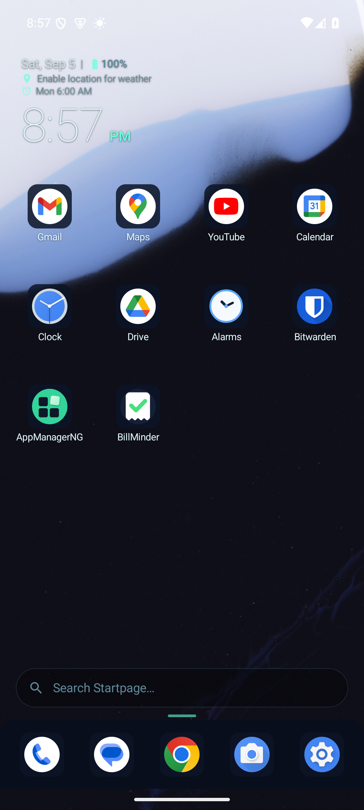
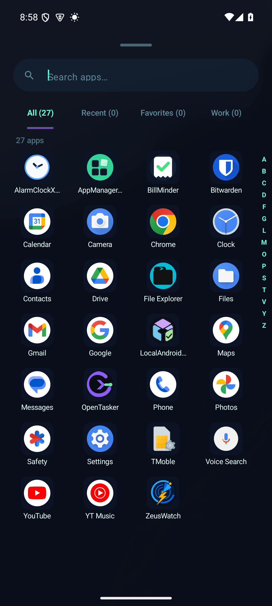
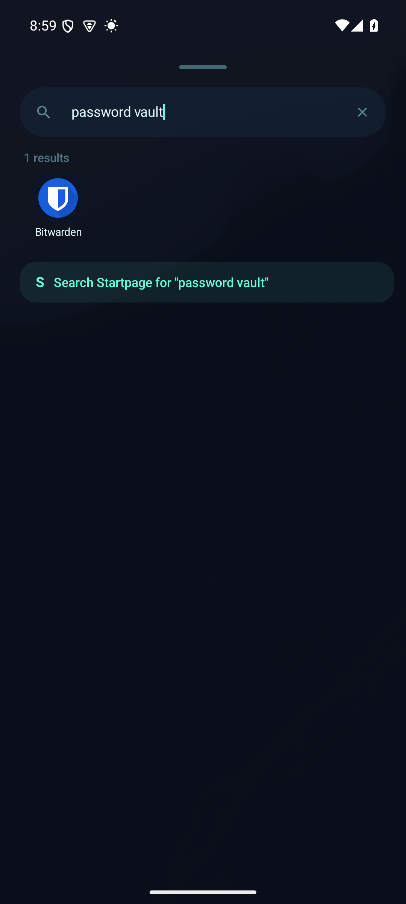
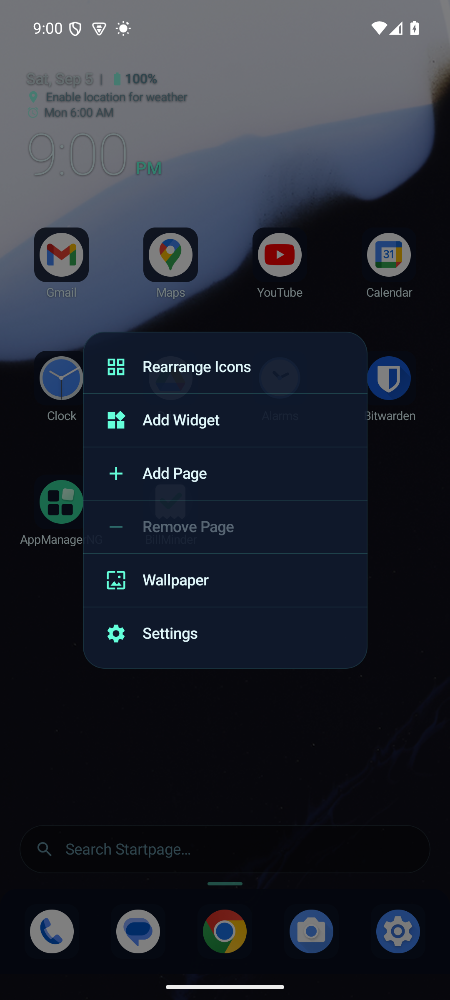
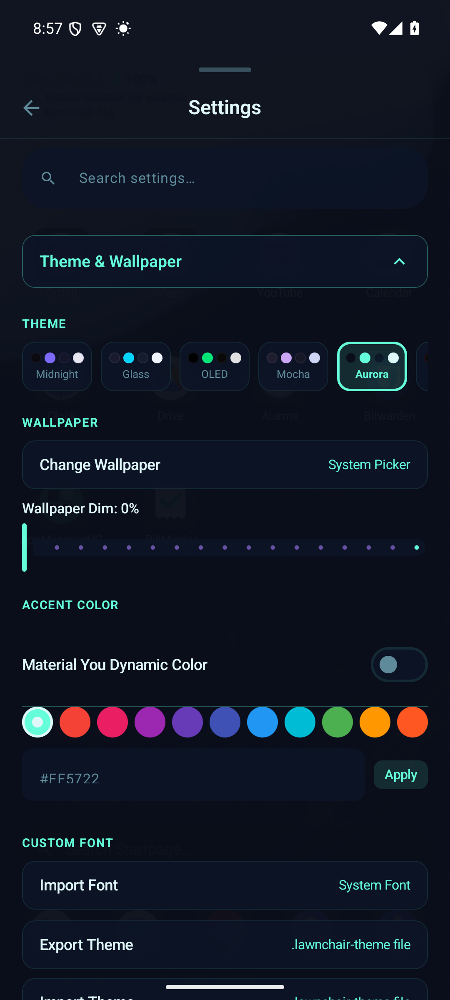

  

<h1 align="center">Lawnchair Lite</h1>

  <strong>Your Android home screen, without the noise.</strong> 
  Fast local search, deep customization, and no ads or accounts.

  
  
  

  

Lawnchair Lite gives you a calm, flexible home screen without turning the launcher into another account or advertising surface. Arrange the grid your way, find apps quickly, and keep the settings that matter close at hand.

Core launcher data stays on your phone. Optional weather and web results are clearly separated, so you decide when the launcher connects to anything.

## See it in action

<table>
  <tr>
    <td align="center"> <b>A home screen that stays focused</b></td>
    <td align="center"> <b>Every app, easy to reach</b></td>
    <td align="center"> <b>Fast search that works locally</b></td>
  </tr>
  <tr>
    <td align="center"> <b>Useful controls one press away</b></td>
    <td align="center"> <b>Six themes with your accent</b></td>
    <td align="center"> <b>Built for modern Android</b></td>
  </tr>
</table>

## Why it earns the Home button

- **Personal without busywork.** Choose a 3 to 8 column grid, tune icon size and labels, add pages, then shape the dock around how you actually use your phone.
- **Search that understands intent.** Fuzzy matching handles imperfect typing. Local phrases such as “my gym app” can find the right result without sending the query to a model service.
- **Power features stay understandable.** Widgets, folders, icon packs, app shortcuts, gestures, work apps, and backup controls live in one searchable settings panel.
- **Built to recover.** Preference corruption, removed packages, failed widget binds, and broken icon resources fall back safely instead of leaving the launcher in a crash loop.

## Made for daily use

| Area | What you get |
| --- | --- |
| Home screen | Multiple pages, folders, widgets, an adjustable dock, page transitions, wallpaper dimming, and a local Smartspace surface |
| Drawer and search | All, Recent, Favorites, and Work tabs with fast scrolling, local semantic matching, calculator results, and unit conversion |
| Appearance | Midnight, Glass, OLED, Mocha, Aurora, and Neon themes with Material You color, custom accents, icon packs, shapes, and font import |
| Controls and backup | Nine gesture triggers, shortcut shelf, selective JSON export, restore preview, Nova import, scheduled local backups, and local diagnostics |

Tablet and foldable layouts keep the workspace visible beside a bounded drawer pane instead of stretching the phone layout across the screen.

## Privacy you can inspect

There are no ads, analytics, cloud accounts, Firebase libraries, or proprietary crash reporting SDKs. No cloud account is required.

| Feature | What leaves the phone |
| --- | --- |
| Normal launcher use | Nothing |
| Contacts, calendar, alarms, and notification badges | Nothing. Access is local and only starts after you grant the related permission |
| Weather | A coarse last known location is sent to Open-Meteo when weather is enabled |
| Web suggestions and search | Your query goes to the search provider you selected when you use the web result |
| Backup | Data goes only to the Android document location you choose or the app's local backup folder |

Android Auto Backup excludes launcher preferences. Manual exports omit search history, usage data, and hidden apps unless you choose to include them.

## Install

1. Open the [latest release](https://github.com/SysAdminDoc/Lawnchair-Lite/releases/latest) and download the signed APK.
2. Allow your browser or file manager to install that download if Android asks.
3. Open Lawnchair Lite and choose it as your default Home app.
4. Grant only the optional permissions needed for features you want.

Future releases install over the current app because official APKs keep the same signing identity. Each release also includes a SHA256 checksum file for download verification.

### Compatibility

- Android 9 or newer
- Phones, tablets, and foldables
- No root access required

Private Space and archived app visibility depend on the Android version and device maker. The release smoke test covers the launcher, drawer search, Settings, and widget picker on an isolated Android emulator.

## Permission guide

Lawnchair Lite asks for launcher capabilities when a feature needs them. Denying an optional permission does not block the home screen.

| Manifest permission | Used for |
| --- | --- |
| `QUERY_ALL_PACKAGES` | Building the app drawer, search index, categories, and gesture app picker |
| `INTERNET` | Optional Open-Meteo weather, web suggestions, and user-triggered web search |
| `VIBRATE` | Haptic feedback for gestures, drawer scrolling, and page limits |
| `KILL_BACKGROUND_PROCESSES` and `EXPAND_STATUS_BAR` | User-triggered quick actions that fall back safely when Android blocks them |
| `POST_NOTIFICATIONS` | Local crash report copy action on Android 13 and newer |
| `READ_CONTACTS` and `READ_CALENDAR` | Optional local search and Smartspace results |
| `ACCESS_COARSE_LOCATION` | Optional Open-Meteo weather |
| `RECEIVE_BOOT_COMPLETED` | Rescheduling a weekly local backup after restart when that schedule is enabled |

Notification listener access supports optional badge counts. Device administrator access supports the optional screen lock gesture.

The in-app permission audit shows current access, why it is used, and what still works when access is denied.

## Build and verify

The project uses Kotlin, Jetpack Compose, Material 3, and Gradle. Install Android Studio with SDK 37, then run:

    $env:JAVA_HOME = "C:\Program Files\Android\Android Studio\jbr"
    $env:ANDROID_HOME = "$env:LOCALAPPDATA\Android\Sdk"
    .\gradlew.bat clean test lintRelease assembleRelease
    .\tools\libre-audit.ps1

Exercise the built APK on an isolated emulator:

    .\tools\android-smoke.ps1 -Serial emulator-5554 -ApkPath .\app\build\outputs\apk\release\app-release.apk

The maintained release uses a local signing key that is not stored in git. Forks should provide their own signing setup before distributing APKs.

## Contributing

Bug reports should include the Android version, device model, steps to reproduce, and the smallest relevant diagnostic excerpt. Please leave personal app names, contacts, and exported launcher data out of public issues.

## License

[MIT](LICENSE)
